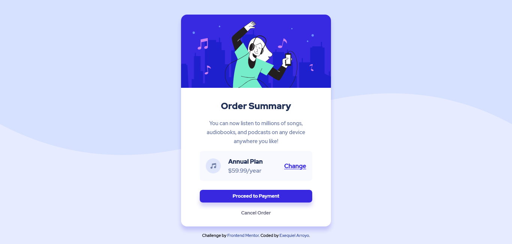

# Frontend Mentor - Order summary card solution

This is a solution to the [Order summary card challenge on Frontend Mentor](https://www.frontendmentor.io/challenges/order-summary-component-QlPmajDUj). Frontend Mentor challenges help you improve your coding skills by building realistic projects. 

## Table of contents

- [Overview](#overview)
  - [The challenge](#the-challenge)
  - [Screenshot](#screenshot)
  - [Links](#links)
- [My process](#my-process)
  - [Built with](#built-with)
  - [Useful resources](#useful-resources)

## Overview

### The challenge

Users should be able to:

- See hover states for interactive elements

### Screenshot

### Links

- Solution URL: [github](https://github.com/exequielarroyo/order-summary-component-main)
- Live Site URL: [order-summary-component-main](https://exequielarroyo.github.io/order-summary-component-main/)

## My process

### Built with

- CSS custom properties
- Flexbox

### Useful resources

- [w3schools](https://www.w3schools.com/csSref/css3_pr_background-size.asp) - This helped me for background-size property. I really liked this pattern and will use it going forward.